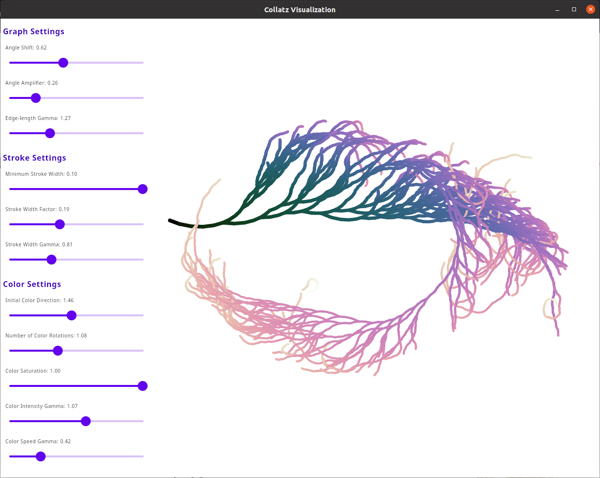

# Collatz Sequence Visualization with Kotlin and Compose Desktop

This repository contains a dynamic visualization of the Collatz graph using [Kotlin](https://kotlinlang.org/) and 
[Compose Multiplatform](https://www.jetbrains.com/lp/compose-mpp/).
The intention is to provide a small but not dead simple example of a complete Compose application.



If you don't know what Collatz sequences are or what is meant by the Collatz graph, just stare at this xkcd for a
moment:


Building such a graph for many numbers, 
displaying them using an [angle path](https://reference.wolfram.com/language/ref/AnglePath.html), and colorizing all
lines with a [scientific color gradient](https://astron-soc.in/bulletin/11June/289392011.pdf), you will get
a visualization as shown in the first image.

## Running the app

Clone the repository and run

```Bash
./gradlew run
```

from a command line (on Windows it's `gradlew.bat`).

You can also open the the project in [IntelliJ IDEA](https://www.jetbrains.com/idea/) and it will import everything
automatically.
Afterwards, you can press the "play" button that should appear next to 

```kotlin
fun main() = application
```

in [Main.kt](src/main/kotlin/Main.kt).